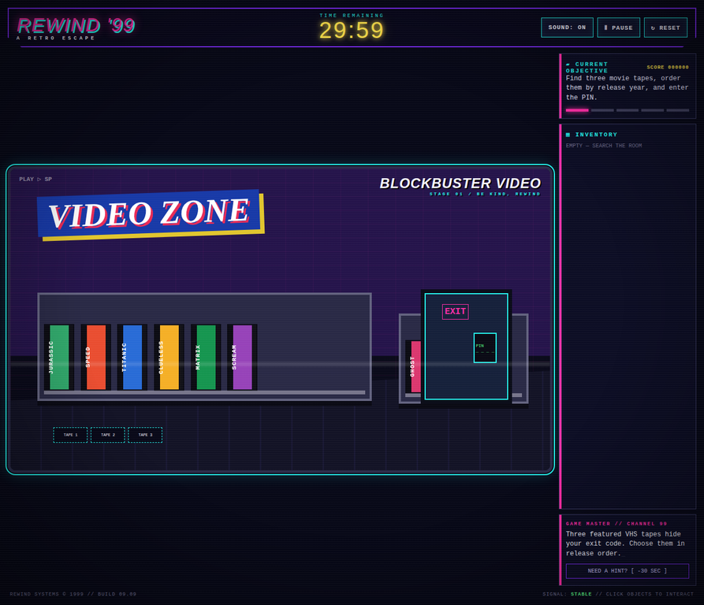

# REWIND '99 — A Retro Escape

A neon-soaked, browser-based escape-room adventure set across five nostalgic 1990s rooms. Search the scene, collect clues, solve compact puzzles, and broadcast the final override before the 30-minute timer expires.



## Play

Open `index.html` in a browser or deploy the repository as a static site. No build step, server runtime, package manager, or external asset service is required.

### Controls

| Input | Action |
| --- | --- |
| Mouse / touch | Select objects, collect clues, adjust controls, and solve puzzles |
| `Escape` | Pause or resume the game |
| `M` | Toggle the 90s theme music |
| `R` | Reset the current run |
| Skip button | Jump to the next room at a 250-point score penalty |
| Drag and drop | Move the boot disk into the computer tower (clicking also works) |

The game is responsive across desktop, tablet, and mobile layouts. Touch-friendly targets are used for the high-score arrows, amplifier controls, channel dial, and RCA patch bay.

## Game flow

1. **Blockbuster Video:** Find Jurassic, Titanic, and Matrix in release order, then enter `9399`.
2. **Teen Bedroom:** Move the beanbag, collect the floppy disk, insert it into the tower, and answer `Tamagotchi`.
3. **Mall Arcade:** Collect three tokens and reproduce the displayed `↑ ↓ ← →` sequence.
4. **Garage Band:** Match the amplifier to bass `30`, treble `70`, and gain `50`.
5. **Broadcast Studio:** Match each RCA cable by color and tune to channel `09`.

Hints cost 30 seconds and 50 score points. Completing actions awards score; remaining time becomes a completion bonus. The best completed score is stored in `localStorage` under `rewind99-high-score`.

The **MUSIC** button controls the original 60-second looping 90s-inspired instrumental theme. Browsers require a direct user gesture before audio can play, so the track starts when the player activates the button rather than autoplaying unexpectedly.

## Local setup

```bash
# Option A: open directly
xdg-open index.html

# Option B: serve locally for a browser-like environment
python3 -m http.server 4173
# visit http://127.0.0.1:4173/
```

## GitHub Pages deployment

1. Push the repository to GitHub.
2. In **Settings → Pages**, select **Deploy from a branch**.
3. Select the default branch and `/ (root)`.
4. Save and wait for the Pages URL to become available.

The project uses relative references to `styles.css`, `game.js`, and `docs/assets/gameplay.webp`, so it is compatible with a repository-root GitHub Pages deployment.

## Project structure

```text
.
├── index.html              # Semantic game shell and room markup
├── styles.css              # Retro visual system, layout, responsive rules, motion
├── game.js                 # State-driven gameplay controller and input handling
├── assets/rewind-99-theme.mp3 # Original looping 90s-inspired instrumental theme
└── docs/assets/gameplay.webp
```

## Quality and performance notes

The original single-file implementation was split into separate HTML, CSS, and JavaScript modules without introducing a framework or dependency overhead. The timer now uses one owned interval that is cleared on game end. Event listeners are registered once during initialization, transient score popups self-remove, and the visibility API pauses the game when a tab is backgrounded. Optional Web Audio feedback fails safely when browser audio is unavailable.

The UI adds a persistent score HUD, non-blocking PIN entry, pause/resume overlay, responsive action controls, keyboard shortcuts, focus-visible states, reduced-motion support, clear feedback toasts, score popups, timer critical-state styling, and a local high-score record.

The visual pass adds a lightweight 3D presentation layer without introducing a heavy rendering dependency: CSS perspective and pointer parallax give each room depth, a device-pixel-aware canvas adds ambient neon particles and score bursts, and success/skip events add screen flash and shake feedback. The effects run through one `requestAnimationFrame` loop, cap device-pixel density, clean up on page exit, and disable non-essential motion when `prefers-reduced-motion` is enabled.

## Verification

- JavaScript syntax validated with `node --check game.js`.
- Static server returned HTTP 200 and served both extracted assets.
- Browser smoke test verified start, timer countdown, score HUD, pause/resume, responsive visual layout, and no browser console errors.

## License

The repository currently does not declare a license. Add one before accepting external contributions or redistributing the game.
